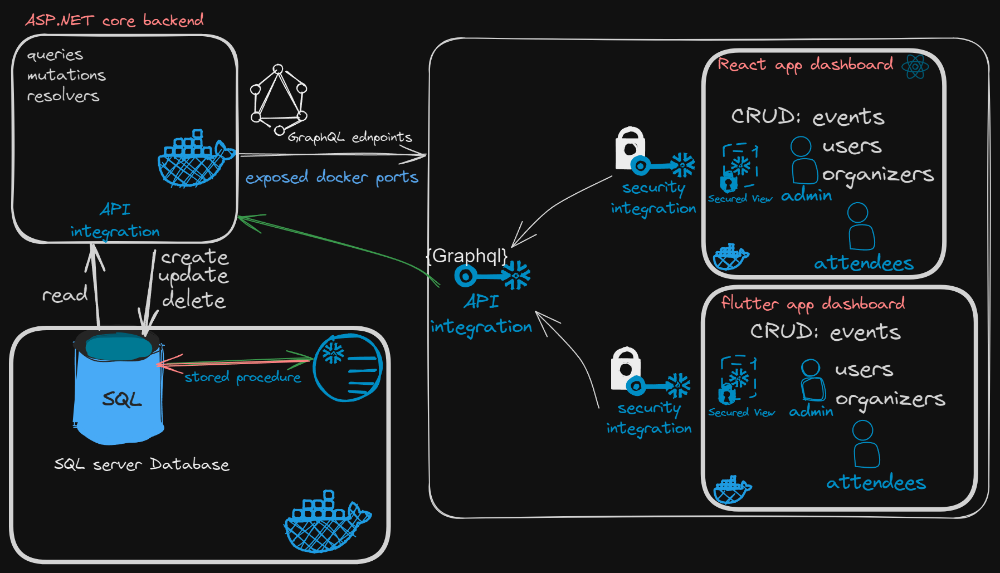

# compiledEMS
## Description
a repo for holding all the code about the Event management system. 

this repo consolidates the code from three different repos. 
It is a single monorepo structure after each module was completed in its own separate repo. THe modules have been added as submodules to their own individual directories. 

Its a very primitive protoype with no authentication and authorization, I intend on using a service like Auth0 to handle all of those. 
An illustration of how the system design looks like is as follows: 

## Getting started
### Requirements 
1. visual studio code/ Visual studio 2022
2. .NET runtime version 8.0.x
3. node runtime
4. Dart And/Or android emulator.
5. a working Brain LOL. 

### setting up
1. Clone the repository by running `git clone repo_name`
2. initialise the submodules by running `git submodule init`
3. update the submodules by running `git submodule update`
4. check for changes as this repo is updated quite often.
5. if you are going to contribute, better follow git best practises, Else i will physically fight you. 

Here is the link to [git best practises](https://about.gitlab.com/topics/version-control/version-control-best-practices/)

